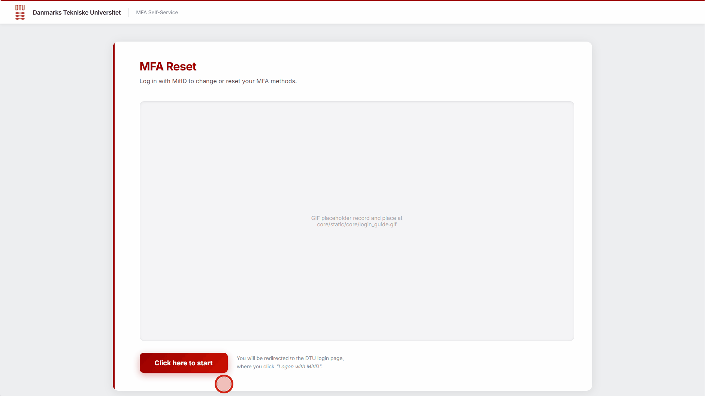

# MFA Reset via MitID

Denne app giver en DTUBasebruger (en bruger med CPR) mulighed for at nulstille deres multifactor, via MitID.



## For udviklere

```bash
git clone https://github.com/vicre/mfareset-via-mitid
cd mfareset-via-mitid
python -m venv venv
source venv/bin/activate
python -m pip install -r requirements.txt
python manage.py migrate
python manage.py runserver